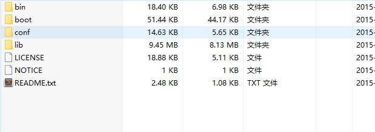
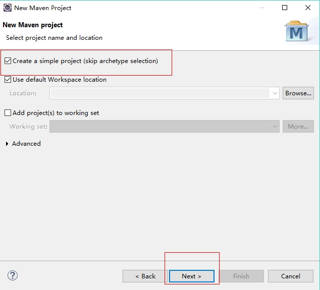
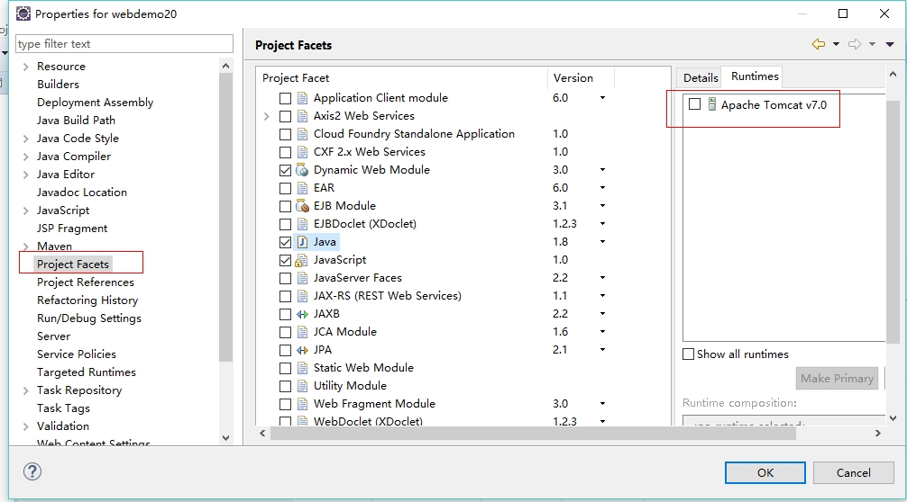

Maven安装&简单使用
=======================

1.安装Maven前，务必确认本机已经安装好了jdk

2.打开[Maven官网](http://maven.apache.org)

3.选择`Download`选项

3.根据自己的操作系统下载，这里演示windows平台的，选择下载的maven安装程序包

4.下载后，请解压该文件

5.配置环境变量 MAVEN_HOME和path

6. 测试MAVEN安装是否成功，出现下图情况，说明安装成功
  

7. MAVEN 在eclipse中的配置
   1. ​
   2. ​
   3. ​
   4. ​
   5. ​
   6. ​
   7. ​
   8. ​
   9. ​
   10. ​
   11. ​
   12. ​
   13. ​
   14. ​
   15. ​
   16. ​
   17. ​
   18. ​
   19. ​
   20. ​
   21. ​
   22. ​
   23. ​